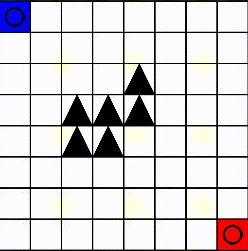

# PyReason Gym 🏋
An OpenAI gym wrapper for PyReason to use in a reinforcement learning Grid World setting.

<!-- Insert Image -->



## Table of Contents
  
* [Getting Started](#getting-started)
    * [The Setting](#the-setting)
    * [The Actions](#the-actions)
    * [The Objective](#the-objective)
    * [Rewards](#rewards)
* [Installation](#installation)
* [Usage](#usage)
    * [Actions](#actions)
    * [Observations](#observations)
    * [Render Modes](#render-modes)
    * [Other Options](#other-options)
* [Contributing](#contributing)
* [Bibtex](#bibtex)
* [License](#License)
* [Contact](#contact)

## Getting Started
This is an OpenAI Gym environment for reinforcement learning in a grid world setting using [PyReason](https://github.com/lab-v2/pyreason) as a simulator.

### The Setting
1. There are two teams: Red and Blue
2. There are two bases: Red Base and Blue Base
3. There are a certain number of agents in each team

### The Actions
There are 9 actions an agent can take:

1. Move Up
2. Move Down
3. Move Left
4. Move Right
5. Shoot Up
6. Shoot Down
7. Shoot Left
8. Shoot Right
9. Do Nothing

### The Objective
The objecive of the game is to kill all enemy agents or make their `health=0`. The game will terminate (or signal `done=True` when this happens). This objective can be changed in the `is_done()` function in [`grid_world.py`](./pyreason_gym/envs/grid_world.py) to determine when the game should be over.

### Rewards
**The reward function is currently not defined** A Reward of `0` is given at each step. You can modify this in the `_get_rew` function in [`grid_world.py`](./pyreason_gym/envs/grid_world.py)

## Installation
Make sure `pyreason==1.5.1` has been installed using the instructions found [here](https://github.com/lab-v2/pyreason#21-install-as-a-python-library)

Clone the repository, and install:
```bash
git clone https://github.com/lab-v2/pyreason-gym
pip install -e pyreason-gym
```
**NOTE:** Do not install this package using `setup.py`--this will not work. Use the instructions above to install.

## Usage
To run the environment and get a feel for things you can run the [`test.py`](./test.py) file which will perform random actions in the grid world for 50 steps.
```bash
python test.py
```

This Grid World scenario needs a graph in GraphML format to run. A graph file has **already been generated** in the [graphs folder](./pyreason_gym/pyreason_grid_world/graph/). However if you wish to change certain parameters such as

1. Number of agents per team
2. Start locations of the agents
3. Obstacle locations in the grid
4. The Grid World size (height, width)
5. The locations of the Red and Blue bases

You will need to re-generate the graph file using the [`generate_graph.py`](./generate_graph.py) script by changing the appropriate parameters. This will generate the graph in the appropriate location for PyReason to find. NOTE: This is optional if you just want to try out the package--you can use the graph file already provided.

This is an OpenAI Gym custom environment. More on OpenAI Gym:

1. [Documentation](https://www.gymlibrary.dev/)
2. [GitHub Repo](https://github.com/openai/gym)

The interface is just like a normal Gym environment. To create an environment and start using it, insert the following into your Python script. Make sure you've [Installed](#installation) this package before this.

```python
import gym
import pyreason_gym

env = gym.make('PyReasonGridWorld-v0')

# Reset the environment
obs, _ = env.reset()

# Take a random action and get observation, rewards, done signal etc.
# This will sample a random action from the action space of the environment 
action = env.action_space.sample()
obs, rew, done, _, _ = env.step(action)

# Keep using `env.step(action)` and `env.reset()` to get observations and run the grid world game.
```

A Tutorial on how to interact with gym environments can be found [here](https://www.gymlibrary.dev/)

### Actions
The action space is currently a list for each team with discrete numbers representing each action:

1. Move Up is represented by `0`
2. Move Down is represented by `1`
3. Move Left is represented by `2`
4. Move Right is represented by `3`
5. Shoot Up is represented by `4`
6. Shoot Down is represented by `5`
7. Shoot Left is represented by `6`
8. Shoot Right is represented by `7`
9. Do Nothing is represented by `8`

A sample action with `1` agent per team is of the form:
```python
# Sample action. The list will increase with the number of agents per team
action = {
    'red_team': [0],
    'blue_team': [2]
}

# Send the action to the environment
obs, rew, done, _, _ = env.step(action)
```

### Observations
Observations contain information about each player's position in the grid (`[x,y]`), their `health` as well as blue and red `bullet` information including the position of the bullet in the grid (`[x,y]`) and its direction.
A sample observation with `1` agent per team is a dictionary of the form:

```python
observation = {
    'red_team': [{'pos': [1,3], 'health': [1]}],
    'blue_team': [{'pos': [7,2], 'health': [1]}],
    'red_bullets': [{'pos': [2,3], 'dir': 1}, {'pos': [5,3], 'dir': 3}],
    'blue_bullets': [{'pos': [7,1], 'dir': 2}]
}
```
Information about agent positions, health, bullet positions and direction can be extracted from this observation space.

### Render Modes
There are a few render modes supported:

1. `human` - Creates a PyGame visualization of the grid world and actions
2. `None` - No rendering, interaction only through actions and observations
3. `rgb_array` - An RGB array of the screen that would have been displayed using `render_mode='human'`. This can be used alongside CNNs etc.

These can be used when creating the environment:
```python
env = gym.make('PyReasonGridWorld-v0', render_mode='human')
# Or
env = gym.make('PyReasonGridWorld-v0', render_mode=None)
# Or
env = gym.make('PyReasonGridWorld-v0', render_mode='rgb_array')
```
If you're using `render_mode='rgb_array` you have to call `env.render(observation)` after `observation = env.step()` to get the rgb data.


### Other Options
If you've generated the graph using the `generate_graph.py` script with a custom `grid size` and custom `number of agents per team`, you can pass these parameters to the grid world while creating the environment:
```python
env = gym.make('PyReasonGridWorld-v0', grid_size=8, num_agents_per_team=1)
```

## Contributing
Pull requests are welcome. For major changes, please open an issue first to discuss what you would like to change.

## Bibtex
If you used this software in your work please cite our paper
```
@inproceedings{aditya_pyreason_2023,
title = {{PyReason}: Software for Open World Temporal Logic},
booktitle = {{AAAI} Spring Symposium},
author = {Aditya, Dyuman and Mukherji, Kaustuv and Balasubramanian, Srikar and Chaudhary, Abhiraj and Shakarian, Paulo},
year = {2023}}
```

## License
This repository is licensed under [BSD-3-Clause](./LICENSE)

## Contact
Dyuman Aditya - dyuman.aditya@asu.edu

Kaustuv Mukherji - kmukherji@asu.edu

Paulo Shakarian - pshak02@asu.edu
